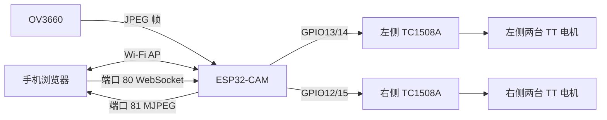

# 系统架构

## 设计概览

ESP32-CAM 同时承担摄像头采集、本地网络、网页服务、控制协议和安全停车逻辑。两块 TC1508A 只负责把 GPIO 方向信号转换为电机驱动电流；ESP32-CAM 不直接给电机供电。

## 组件职责

| 组件 | 职责 | 不承担的职责 |
| --- | --- | --- |
| 手机网页 | 显示视频、发送动作/停止命令、按住时发送心跳、显示诊断信息 | 不作为唯一停车保护 |
| ESP32-CAM | 摄像头、热点、HTTP/WebSocket、命令仲裁、超时和动作上限 | 不直接提供电机功率 |
| OV3660 | 输出 JPEG 图像帧 | 不进行视觉识别 |
| TC1508A | 按两路方向输入驱动一侧两台电机 | 不判断通信是否正常 |
| 两套电源 | 分别给 ESP32-CAM 和电机系统供电 | 两套正极不得相连 |

## 网络接口

| 地址或接口 | 用途 |
| --- | --- |
| `ESP32-CAM-Car` | ESP32-CAM 建立的本地 Wi-Fi 热点 |
| `http://192.168.4.1/` | 控制网页 |
| 端口 80 `/ws` | 持久 WebSocket 控制与状态通道 |
| 端口 81 `/stream` | MJPEG 视频流 |

浏览器按下动作按钮时发送一次 `move:<command>`，按住期间每约 200 ms 发送 `heartbeat`，松开或页面失焦时发送 `stop`。车端只允许一个有效控制连接；新连接建立时先停止电机并替换旧连接。

## 运动控制

固件使用四种抽象动作，避免在机械方向未单独标定时错误命名：

- `both-a`：左右两侧均为方向 A。
- `both-b`：左右两侧均为方向 B。
- `pivot-a`：左侧方向 B、右侧方向 A。
- `pivot-b`：左侧方向 A、右侧方向 B。

直接改变运行方向会先触发停车和锁止，必须收到明确的 `stop` 后才能再次启动，避免用快速换向绕过动作时间上限。

## 安全停车链

停车保护由车端独立执行：

1. 初始化 GPIO 前先把四路输出锁存为 LOW。
2. 收到浏览器 `stop` 时立即关闭四路输出。
3. 有效控制 WebSocket 关闭时立即关闭输出。
4. 运行中约 500 ms 没有收到有效心跳时停车并锁止。
5. 单次连续动作达到约 5000 ms 时停车并锁止。
6. 发生直接换向请求时先停车并锁止。

软件保护不能消除 GPIO12/GPIO15 在芯片复位阶段的启动配置脚约束，因此仍必须遵守[接线与上电顺序](hardware/wiring.md)。

## 视频恢复与诊断

- 车端统计视频流开始、结束、活动连接、已发送帧和抓帧失败次数。
- 网页每 2 s 通过现有 WebSocket 查询一次状态。
- 页面检测到连接错误、车端无活动流或超过 6.5 s 没有新帧时重新连接视频。
- 视频重连使用逐步增加的等待时间，最高约 10 s，避免反复快速连接。
- 启动标识变化用于提示当前页面会话中可能发生过 ESP32 重启；串口 `Reset code` 用于进一步诊断。
