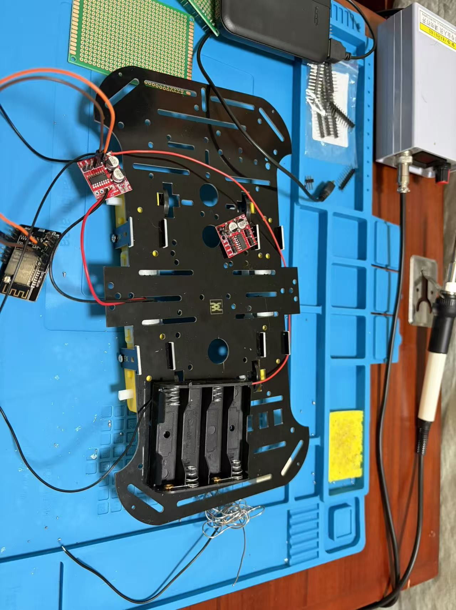
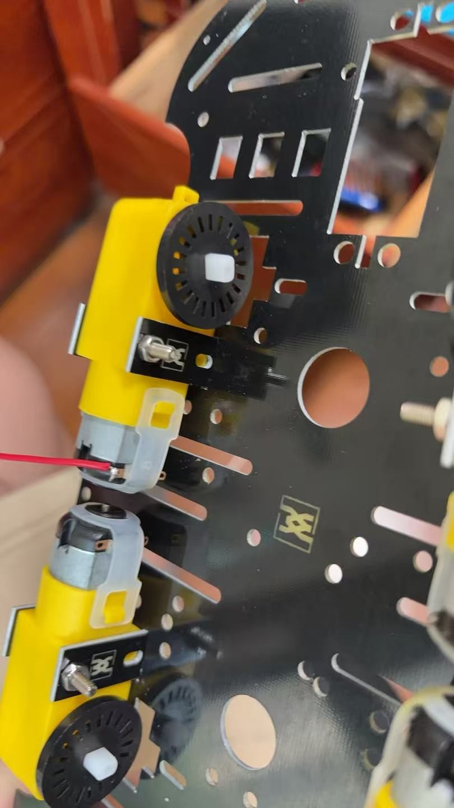

# 第 3 天：单个电机测试记录

- 日期：2026-08-07
- 实机验证日期：2026-08-15
- 分支：`test/day3-single-motor`
- 测试范围：仅测试 1 块 TC1508A 的 MOTOR-A 通道和 1 个空载 TT 电机
- 当前结论：固件已编译、烧录，单电机空载测试已完成实机验证；第 3 天测试**已完成**

## 今日完成

### 机械与焊接

1. 将 4 个 TT 电机安装到小车底板，并调整相邻电机的安装位置。
2. 确认测速码盘与底板之间留有间隙，可以自由转动。
3. 给一个电机焊接红、黑两根引线。
4. 首块 TC1508A 曾在所有裸焊孔上焊排针；拆除电机输出端排针时，板上电容明显发热并出现轻微焦味。该板未见变形或翘起，但按“疑似过热板”处理，暂不通电使用。
5. 改用一块未使用的 TC1508A：只在 `IN1`～`IN4` 控制端焊排针，将电机线直接焊到 `MOTOR-A`，电池线直接焊到电源 `+`/`-`。
6. 在底板上试放 ESP32-CAM、两块驱动板、4 节 AA 电池盒和充电宝，检查线长与空间。

### 固件

将第 2 天摄像头固件保留在 `feature/day2-camera-stream` 分支，本分支改为单电机专用测试固件：

- `GPIO13` → TC1508A `IN1`
- `GPIO14` → TC1508A `IN2`
- `GPIO4` → ESP32-CAM 板载闪光灯，作为启动倒计时提示
- 上电后等待 25 秒，闪光灯再倒计时 5 秒
- 正转 2 秒 → 停止 3 秒 → 反转 2 秒 → 保持停止
- 每次运行限制为 2 秒，降低接线错误或机械卡滞造成的风险
- 保留串口命令：`f` 正转、`r` 反转、`s` 立即停止、`h` 显示帮助

## 已验证与未验证

| 项目 | 状态 | 证据或说明 |
| --- | --- | --- |
| PlatformIO 编译 | 已通过 | `esp32cam` 环境构建成功 |
| 固件烧录 | 已通过 | 经 `/dev/cu.usbserial-10` 写入并完成哈希校验 |
| 4 个电机机械安装 | 已完成 | 见本目录照片 |
| 单电机测试线路 | 已验证 | 上电前确认共地导通，并确认 ESP32-CAM 与 TC1508A 的两路正极相互独立 |
| ESP32-CAM 独立供电 | 已验证 | USB 供电线实测 `+5.16 V`；脱离烧录底座后正常启动，白色闪光灯按程序闪烁 5 次 |
| 电机正转、停止、反转 | 已验证 | 实机观察到“一个方向约 2 秒 → 停止约 3 秒 → 相反方向约 2 秒 → 最终持续停止” |
| 新 TC1508A 工作状态 | 已验证 | 单个 MOTOR-A 通道完成空载测试，过程无异常 |

> 编译成功、烧录成功和硬件动作成功是三个不同结论。本记录分别保留了三类结果；第 3 天完成状态以 2026-08-15 的实机动作观察为依据。

## 2026-08-15 实机验证过程

1. 首次使用两芯 USB 供电线直接供电时听到短暂电流声并闻到轻微焦味，因此立即断电，没有继续尝试。
2. 供电线空载测得红线相对黑线为 `+5.16 V`，确认线色与实际极性一致。
3. ESP32-CAM 完全断电时，`5V`—`GND` 与 `3V3`—`GND` 在 `200 Ω` 档均显示 `OL`，未发现明显硬短路；目视检查未发现烧黑、开裂或变形。
4. 通过 ESP32-CAM-MB 供电约 31 秒，白色闪光灯按固件设定闪烁 5 次，全程无异常。
5. 使用两芯 USB 线给 ESP32-CAM 独立供电约 31 秒，再次观察到闪光灯按时闪烁 5 次，全程无异常。
6. 断电完成接线后，万用表确认 ESP32-CAM 与 TC1508A 共地，并确认两套电源正极没有直接相连。
7. 车轮未安装，电机输出轴无负载。ESP32-CAM 先上电，随后接通 4 节 AA 镍氢电池组成的电机电源。
8. 闪光灯倒计时结束后，电机依次完成两个相反方向的 2 秒运行，中间停止约 3 秒，最后保持停止；用户报告整个过程没有异常。

上述短暂电流声的具体来源没有被复现，因此不对根因作确定判断。后续仍需坚持断电接线、上电前核对极性，并避免带电移动母头。

## 现场安全状态

- 测试结束时 AA 电池与充电宝均断开。
- 电机电流不经过 ESP32-CAM。
- ESP32-CAM 与 TC1508A 需要共地，但两套电源的正极不得相连。
- 疑似过热的 TC1508A 与待测新板分开放置，后续不直接上电复用。
- 禁止堵转测试；首次测试时车轮悬空、电机无负载，每个方向只运行 2 秒。

## 过程照片

### 底板总体布局

### 电机引线焊接

## 本日成功判据与结果

成功判据为：空载电机完成“一个方向约 2 秒、停止约 3 秒、相反方向约 2 秒、最后持续停止”，且系统没有出现异常。2026-08-15 的实机观察符合该动作顺序，因此第 3 天标记为完成。

## 相关资料

- [BOM 实物照片 PDF](../../../hardware/reference/bom-physical-photos.pdf)
