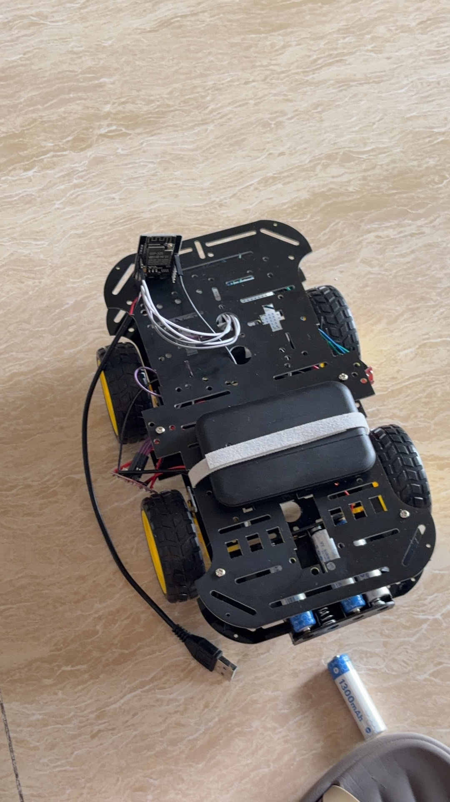

# 第 7 部分：最终网页控制固件

- 日期：2026-08-26 至 2026-08-29
- 初版分支：`feature/final-web-control`
- 初版可审查提交：`75706f3`
- 优化分支：`feature/websocket-control-reliability`
- 起点：Part 6 已验证提交 `fd36673`
- 摄像头参考：Part 2 已验证提交 `2a17b08`
- 当前状态：初版完成实机初测；优化版于 2026-08-29 完成用户实机验收，第一阶段功能验收通过

## 已验证基础

### Part 2 摄像头与网络

从提交 `2a17b08` 保留以下已验证实现：

- AI Thinker 兼容摄像头引脚映射。
- OV3660 识别以及画面翻转、亮度和饱和度修正。
- JPEG、QVGA、质量 12 的摄像头参数。
- 检测到 PSRAM 时使用两个 PSRAM 帧缓冲区和最新帧抓取模式。
- ESP32 无线路由器（AP）模式：热点 `ESP32-CAM-Car`，网页地址 `http://192.168.4.1/`。
- 端口 80 提供网页，端口 81 提供 MJPEG 实时视频流。

仓库没有单独的 Part 2 测试记录文件；上述结论以已验证提交和 `AGENTS.md` 的里程碑记录为边界。

### Part 6 四电机映射

继续使用 Part 6 已完成空载实机验证的 GPIO：

| 功能 | ESP32-CAM GPIO |
| --- | --- |
| 左侧输入 1 / 输入 2 | GPIO13 / GPIO14 |
| 右侧输入 1 / 输入 2 | GPIO12 / GPIO15 |
| 板载白色闪光灯 | GPIO4 |

网页仍使用“双侧方向 A/B”和“原地组合 A/B”。车轮机械方向尚未形成记录，因此不把它们提前命名为前进、后退、左转或右转。

## 初版 `75706f3` 实机初测

用户于 2026-08-27 报告：

| 项目 | 结果 | 结论边界 |
| --- | --- | --- |
| PlatformIO 编译 | 通过 | 对应初版固件，不代表本次优化版 |
| 固件烧录 | 成功 | 用户现场完成 |
| ESP32-CAM-Car 热点 | 手机可发现并连接 | 初版启动和 AP 基本功能正常 |
| 网页与摄像头画面 | 均能出现 | 初版的页面和视频链路曾正常工作 |
| 四台电机 | 均能动作 | 未据此补写机械方向、负载或长期可靠性结论 |
| 控制体验 | 感觉卡顿 | 初版每约 200 ms 新建一次 HTTP 控制请求 |
| 单次动作距离 | 仅十几厘米 | 初版硬上限为 1.5 秒 |
| 长时间视频 | 曾消失 | 当时未记录热点是否同时消失，原因未确定 |

摄像头和主板还由用户使用卖家固件、独立 `5 V / 1 A` 充电宝供电完成过正常验证。这降低了“摄像头本体已损坏”的可能性，但不能排除整车运行时的电机干扰、电源波动、网络中断或 HTTP/视频负载问题。

## 优化版控制协议

- 浏览器使用一条持久 WebSocket，不再每 200 ms 反复新建 HTTP 控制请求。
- 按下动作按钮时发送一次动作消息；按住期间每约 200 ms 发送心跳；松开时立即发送停止消息。
- 触摸取消、按钮失去指针捕获、页面失焦、页面隐藏和页面退出都会请求停止。
- WebSocket 断开时，车端连接清理函数立即停止输出；如果连接未被及时识别，车端仍会在约 500 ms 通信超时后停车。
- 新控制连接建立时先强制停止，旧连接不能继续控制；同时只保留一个有效控制连接。
- 车端独立执行 500 ms 通信超时和 5000 ms 单次连续动作上限，不依赖浏览器正确运行。
- 达到动作上限、通信超时或尝试直接切换方向后，车端锁止移动；必须收到明确停止消息，也就是用户松开后，才允许下一次动作。

## 视频断流恢复与诊断

- 页面每 2 秒通过现有 WebSocket 查询一次低负载状态，不新增周期性 HTTP 控制连接。
- 车端记录视频流开始数、结束数、成功发送帧数和抓帧失败数。
- 页面发现视频连接报错、车端没有活动流，或超过 6.5 秒没有新帧时自动重连。
- 重连间隔从约 1 秒指数增加，最高约 10 秒，并加入少量随机延迟；同一时间只保留一个重连计时器，避免重连风暴。
- 每次启动生成新的启动标识。页面同时显示启动标识和运行时间；启动标识变化说明 ESP32 在当前页面会话期间发生过重启。
- 串口启动日志继续打印 `Reset code`，并新增启动标识、控制连接、活动视频流、累计帧和空闲内存。
- 如果控制 WebSocket 仍在线但视频停止，页面会标记为“视频流单独中断”；如果控制与视频同时中断，则提示检查热点、启动标识和串口复位信息。

自动重连只改善软件恢复能力，不证明电机干扰、电源波动或接线问题已经解决。故障归因仍需要把热点状态、启动标识、串口日志和供电观察放在同一次实机测试中记录。

## 停车保护与启动约束

优化版继续保留以下独立边界：

1. 启动时默认停止：摄像头和 Wi-Fi 初始化前，先把 GPIO12、GPIO13、GPIO14、GPIO15 设为输出并保持 LOW。
2. 松手或页面状态变化时，浏览器立即通过持久连接发送停止。
3. 超过约 500 ms 没有有效控制心跳时，车端独立停车并锁止。
4. 一次连续动作达到 5000 ms 时，车端独立停车并锁止；必须松开后再按。
5. 不允许在未先停止的情况下直接切换动作方向。

GPIO12 和 GPIO15 是 ESP32 启动配置脚。软件不能消除芯片复位阶段的硬件约束：

- ESP32-CAM 启动时电机电源必须关闭。
- 只有启动完成后，才可按后续实机测试步骤接通电机电源。
- 两块 TC1508A 驱动板供电期间不得重启或复位 ESP32-CAM。

## 优化版软件验证结果

| 项目 | 结果 | 证据或边界 |
| --- | --- | --- |
| PlatformIO 环境 | `esp32cam` | AI Thinker ESP32-CAM，Arduino 框架 |
| 源码编译与链接 | 通过 | 生成 `.pio/build/esp32cam/firmware.bin` |
| RAM 使用 | 48,076 B（14.7%） | 总量 327,680 B |
| Flash 使用 | 861,817 B（27.4%） | 可用量 3,145,728 B |
| 网页 JavaScript 语法 | 通过 | 从固件 HTML 中提取脚本后由 Node.js 解析 |
| HTTP 轮询移除检查 | 通过 | 页面不再包含 `fetch()` 或 `/control` 控制路径 |
| 代码格式检查 | 通过 | `git diff --check` 无错误 |
| 优化版固件烧录 | 后续通过 | 2026-08-29 用户使用最新版固件完成实机验收 |
| 优化版 WebSocket 控制 | 后续通过 | 见下方 2026-08-29 实机验收记录 |
| 5 秒上限与断线停车 | 后续通过 | 用户按验收清单确认两项保护均正常 |
| 视频自动重连与诊断 | 后续通过 | 用户按验收清单确认视频恢复正常 |

第一次编译尝试因运行环境不能写入 PlatformIO 用户缓存锁文件而停止，尚未进入源码编译。允许使用已安装工具链目录后，完整编译、链接和固件生成成功；前一次权限错误不属于源码编译失败。

2026-08-31 第一阶段文档收尾时再次运行 `pio run`，结果成功，资源占用仍为 RAM 48,076 B（14.7%）和 Flash 861,817 B（27.4%）；同时再次通过内嵌 JavaScript 语法检查、旧 HTTP 轮询路径检查和 `git diff --check`。本次只复核软件，没有重新烧录或替代 2026-08-29 的用户实机验收。

## 2026-08-29 优化版实机验收

- 测试分支：`feature/websocket-control-reliability`
- 测试仓库版本：`90647f6`
- WebSocket 优化实现提交：`4240cf4`
- 连续测试时间：10 分钟
- 重复操作次数：11 次
- 用户总体观察：小车运行情况符合预期，无一项异常

| 验收项目 | 用户报告结果 | 结论边界 |
| --- | --- | --- |
| 优化版编译与烧录 | 通过 | 使用最新版固件完成实机运行 |
| `ESP32-CAM-Car` 热点 | 正常 | 手机能够连接并访问车端 |
| 网页和实时视频 | 正常 | 验收期间显示符合预期 |
| 四个运动命令 | 正常 | 四种页面控制动作均按预期驱动小车 |
| 松手停车 | 正常 | 用户按验收清单确认 |
| 控制连接断开停车 | 正常 | 用户按验收清单确认 |
| 5 秒动作上限停车 | 正常 | 用户按验收清单确认 |
| 视频中断恢复 | 正常 | 用户按验收清单确认 |
| 复位、异常发热、焦味、失控或接触不良 | 均未观察到 | 仅覆盖本次 10 分钟、11 次操作 |

本表记录的是用户现场观察。源码中的 `500 ms` 通信超时和 `5000 ms` 动作上限是设计参数；本次没有提供专用仪器测得的实际停车延迟，因此不把设计值写成测量结果。除下方整车外观照片外，未提供的串口原始日志、其他照片或视频不补写为已有证据。

## 整车外观证据

该照片由用户在第一阶段收尾时提供，能够记录四轮底盘、ESP32-CAM 和现有部件的可见装配状态。照片不能替代断电导通检查、供电极性检查或实机动作观察；功能通过结论仍以本页的用户实机验收记录为依据。仓库副本经过重新编码，不保留原始照片的设备或定位元数据。

## 当前结论

初版 `75706f3` 证明了摄像头、网页和四电机整合路径可行，同时暴露了 HTTP 轮询卡顿、1.5 秒距离过短和视频中断问题。优化版用持久 WebSocket、5 秒动作上限、车端通信超时停车和视频重连改进这些问题，并在 2026-08-29 的 10 分钟、11 次操作中完成实机验收。第一阶段原型功能据此标记为通过；长期连接可靠性、电磁干扰、续航、开环直线精度和正式线束仍属于后续工作。
